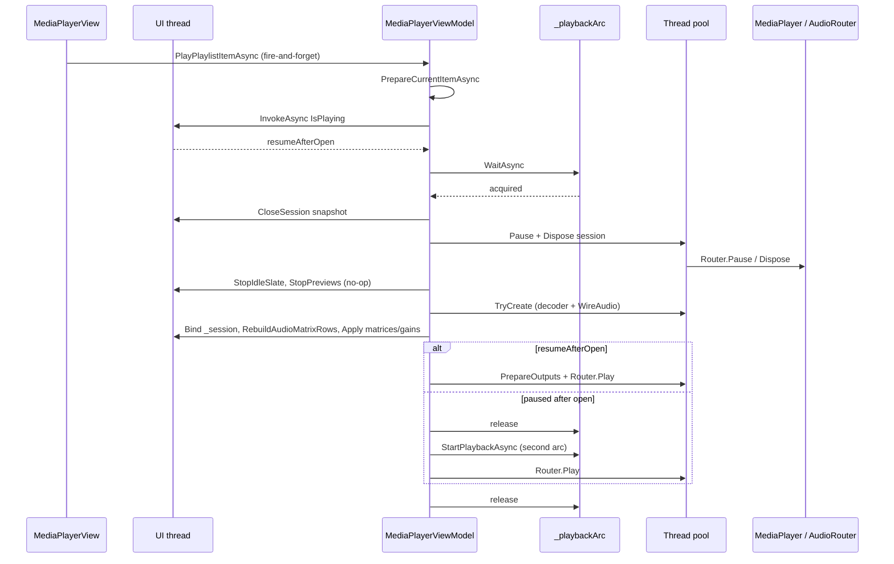

# HaPlay transport & playlist responsiveness — performance analysis

Status: investigation — **segment traces analyzed** (May 2026)  
Scope: `MediaPlayerViewModel`, `HaPlayPlaybackSession`, `S.Media.*` playback stack  
Related: [MediaFramework-Architecture.md](MediaFramework-Architecture.md), [HaPlay-MediaPlayer-UX-Improvements.md](HaPlay-MediaPlayer-UX-Improvements.md)

---

## Executive summary

**Root cause confirmed:** playlist track changes while playing spend **~2.0–2.2 s** in `CloseSession: Router.Pause`, which matches the **2 s `CancellationTokenSource` budget** in `CloseSessionCoreInnerAsync` — pause does not finish before the cap fires, then dispose runs (~100–190 ms) and open/resume adds another **~120–260 ms**. Total perceived delay: **~2.3–2.5 s** per hop.

This is **not** UI prechecks, matrix rebuild, or `Router.Play` on the new file (those are **&lt;25 ms** combined on the warm path). The decoder cache helps (`TryCreate` **114 ms** hit vs **260 ms** miss) but cannot offset a 2 s pause.

**Contrast:** the same `Router.PauseSkippingSharedMuxFlush` call from the **Pause** button completes in **3.7 ms**. Play/Stop on a loaded session are also fast (**25 ms** / **54 ms**). Sluggishness is specific to **pause-before-dispose during full session swap**, not transport in general.

**Highest-impact fix to try first:** stop calling coordinated `Pause` immediately before `Dispose` on playlist swap (dispose already tears down routers), or make teardown use a non-blocking stop path; investigate why `AvPlaybackCoordinator.Pause` blocks ~2 s during close but not from `PauseAsync` (likely `VideoPlayer.StopInternal` / pump join — `AudioRouter.Pause()` ignores the host `CancellationToken` today).

---

## 1. Measured run — segment traces (May 2026)

Scenario: three playlist double-taps (cold start → next while playing → next while playing), then Pause, Play, Stop. Single PortAudio output (`count=1`). FLAC/MP3 mix implied by libav `mp3float` warnings on run 3.

### 1.1 Summary table

| Scenario | Total | Dominant step | Δ dominant | Other notable |
|----------|------:|---------------|----------:|---------------|
| **A — First open** (not playing) | **376 ms** | `TryCreate` (cache miss) | **259 ms** | Second arc + `StartPlayback` **~43 ms**; matrix **~18 ms** |
| **B — Track change** (playing) | **2530 ms** | `CloseSession: Router.Pause` | **2195 ms** | `Dispose` **187 ms**; `TryCreate` hit **114 ms**; resume `Play` **0.9 ms** |
| **C — Track change** (playing, MP3) | **2303 ms** | `CloseSession: Router.Pause` | **2056 ms** | `Dispose` **101 ms**; `TryCreate` miss **120 ms**; resume `Play` **3.9 ms** |
| **Pause** (loaded session) | **13 ms** | `Router.Pause` | **3.7 ms** | — |
| **Play** (after pause) | **25 ms** | UI flag update | **21.5 ms** | `Router.Play` **2.1 ms** |
| **Stop** | **54 ms** | `SeekCoordinated` to zero | **43.8 ms** | No full session dispose |

### 1.2 Track-change time budget (runs B & C)

| Segment | Run B | Run C | % of total (B) |
|---------|------:|------:|---------------:|
| `CloseSession: Router.Pause` | 2195 ms | 2056 ms | **~87%** |
| `CloseSession: Dispose` | 187 ms | 101 ms | ~7% |
| `TryCreate` (open new file) | 114 ms | 120 ms | ~5% |
| UI bind + matrix + routes | ~15 ms | ~4 ms | &lt;1% |
| `Router.Play` (resume) | 0.9 ms | 3.9 ms | &lt;1% |
| `_playbackArc` wait | 0 ms | 0 ms | 0% |

### 1.3 Cold open time budget (run A)

| Segment | Δ ms |
|---------|-----:|
| `TryCreate` (cache=miss) | 259 |
| `RebuildAudioMatrixRows` + matrices | 18 |
| `StartPlayback: Router.Play` | 11 |
| Everything else | &lt;90 |

Two `_playbackArc` cycles (open, then start) add minor overhead; acceptable for first play.

### 1.4 Key interpretations

1. **Pause hits the 2 s cap during close** — deltas of **2195 ms** and **2056 ms** align with `CloseSessionCoreInnerAsync`’s inner `CancellationTokenSource(TimeSpan.FromSeconds(2))` around `PauseSkippingSharedMuxFlush`. The operation is **not completing** within the budget; dispose proceeds after cancel/timeout.

2. **Standalone Pause is fast** — same API surface, **3.7 ms**, so the router is healthy; the stall is tied to **teardown-during-playback** (or pause+dispose back-to-back), not a universally slow `Pause`.

3. **Decoder cache works** — run B: `cache=hit`, TryCreate **114 ms**; run A/C: miss **259–120 ms**. Pre-open on track change (Q1) remains worthwhile but is secondary.

4. **Resume `Play` is cheap** — **&lt;4 ms** once the new session exists; users wait on **old session stop**, not new session start.

5. **MP3** — `mp3float` timestamp warnings appear around close on run C; may correlate with slow `VideoPlayer` stop but pause duration is similar on run B (likely FLAC→FLAC), so MP3 is not the sole factor.

6. **`_playbackArc` contention** — `waited 0.0ms` everywhere; serialization is not the bottleneck in this capture.

---

## 2. How to read `ChangeTrace` timestamps

HaPlay logs segment timings to the console:

```
[ChangeTrace] BEGIN #1 playlist double-tap
[ChangeTrace] +2.1ms (total 2.1ms) view prechecks done
[ChangeTrace] +15.3ms (total 17.4ms) PrepareCurrentItemAsync
...
[ChangeTrace] DONE (total 445.2ms, depth was 1)
```

- **`+Δms`** — time since the **previous** line (the number to optimize).
- **`(total Tms)`** — time since `BEGIN`.
- Disable with `MF_HAPLAY_CHANGE_TRACE=0`.

Older traces used cumulative-only stamps via `SDebug.TraceTime["ChangeTrace"]`; those are replaced.

**How to spot the 2 s pause cap:** look for `CloseSession: Router.Pause done` with **`+2000ms`** (±200 ms) immediately after `Router.Pause begin`.

---

## 3. End-to-end flow (playlist double-tap)



**Entry points sharing this path:**

- Playlist double-tap (`MediaPlayerView.axaml.cs`)
- Next / previous track commands
- Loop timer auto-advance (after pause; then `OpenOrReloadAsync` + optional second arc for play)
- `PlayAsync` when nothing loaded (sets `IsPlaying = true` before open)

---

## 4. Hotspots (by layer)

### 4.1 UI / ViewModel (`MediaPlayerViewModel`)

| Area | What happens | Cost driver |
|------|----------------|-------------|
| **`_playbackArc`** | Single `SemaphoreSlim(1,1)` for all transport + `OpenOrReloadAsync` + loop-timer router ops | Any long operation blocks play/pause/stop/seek and the next track change |
| **`_isTransportBusy`** | Set for entire `WithPlaybackArcAsync` | Buttons disabled for full close+open+play |
| **Many `InvokeAsync` calls** | `OpenOrReloadAsync` uses ≥4 UI posts per track change | Dispatcher queue depth; risk of head-of-line blocking behind layout/property churn |
| **`CloseSessionCoreInnerAsync`** | UI snapshot → `RunBoundedAsync` (Pause 2 s cap, Dispose 8 s cap) → UI cleanup | **Measured: Pause consumes full 2 s cap on track change** (~87% of hop); Dispose ~100–190 ms. Standalone Pause button: **3.7 ms** |
| **`RebuildAudioMatrixRows`** | Clears/rebuilds `AudioMatrixRows`, input trims, route rows; raises `AudioMatrixLayoutChanged` | First run ~hundreds of ms; scales with outputs × channels |
| **`ApplyAllOutputMatricesToSession`** | Per selected output: `TrySetOutputMatrix` removes all routes and re-`AddRoute`s each cell | Router graph mutations under lock; redundant when layout unchanged |
| **`ApplyAllOutputGainsToSession`** | Per output `TrySetOutputMatrixCompoundGain` or legacy gain | Usually cheaper than full matrix rebuild |
| **`_cuePreRoll.InvalidateAll()`** | Called at every open | Drops warmed cue decoders unnecessarily on simple playlist hops |
| **`StopPreviewsForPlayback`** | Documented **no-op** (previews stay alive) | Harmless but adds noise in traces |
| **`PreOpenAdjacentPlaylistItems`** | Only in `OnIsPlayingChanged(true)` | **Does not run** on track change while already playing → decoder cache often cold on 2nd/3rd hop unless user paused between tracks |

### 4.2 HaPlay session (`HaPlayPlaybackSession`)

| Area | What happens | Cost driver |
|------|----------------|-------------|
| **Full session recreate** | Every `OpenOrReloadAsync` closes `_session` and `TryCreate`s a new `MediaPlayer` + wiring | NDI carrier release/re-acquire, PortAudio acquire, new `VideoOutputPump`s, new `AudioRouter` graph |
| **`TryCreate`** | `MediaContainerDecoder.Open` (or cache), `MediaPlayer.Open`, `WireAudio`, logo sinks | FFmpeg probe + decoder init; HW path when any NDI output selected (`TryHardwareAcceleration: !anyNDI`) |
| **`PrepareOutputsBeforePlay`** | Once per session (`_primedOnce`): up to 12 black frames × 2 ms pacing | Skipped on track change **within same session** — but **new session resets** `_primedOnce`, so priming runs again every track |
| **`Router.Play`** | `AvPlaybackCoordinator.Play` → optional prefill, `audioRouter.Start()`, `video.Play()` | Pump threads start; first chunks through resamplers/NDI |

There is **no API** to replace the decoder/file in an existing `HaPlayPlaybackSession` while keeping output wiring.

### 4.3 MediaFramework (`S.Media.Core` / `S.Media.FFmpeg`)

| Area | What happens | Cost driver |
|------|----------------|-------------|
| **`PauseSkippingSharedMuxFlush`** | Skips `FlushCodecPipelines` (good — avoids demux deadlock) | Still stops router + video (`AudioRouter.Pause` → pump flush; `VideoPlayer.Pause` → `StopInternal`). **`AudioRouter.Pause()` takes no `CancellationToken`** — host CTS may not abort audio pump join; video side may burn the 2 s cap |
| **`AudioRouter` per-output pumps** | Default 8 chunks × 480 samples @ 48 kHz ≈ **80 ms** buffer per output | Pause must interact with pump threads; multiple outputs multiply work |
| **`MediaPlayer.Dispose`** | Disposes bundle: video router, audio router, clocks, decoder | Demux thread shutdown, codec close |
| **MP3 warnings** | `Could not update timestamps for skipped/discarded samples` | libav noise on gapless/cutover; not necessarily a HaPlay bug, but indicates decoder reset stress |

Framework design is sound for **correctness** (bounded waits, skip-flush policy, per-output isolation). The cost is inherent to **stop graph → destroy → rebuild graph** on every playlist item.

---

## 5. Issues & simplifications

### 5.1 Confirmed gaps

1. **`CloseSession` pause-before-dispose blocks ~2 s on playlist hop (primary)**  
   Segment traces show `Router.PauseSkippingSharedMuxFlush` running until the **2 s inner CTS** fires during `CloseSessionCoreInnerAsync`, while the same call from `PauseAsync` finishes in **&lt;4 ms**. Dispose (~100–190 ms) and open (~120–260 ms) are secondary. **Hypothesis:** coordinated pause waits on video decode and/or audio pump flush during active playback; dispose would stop the graph anyway — pre-pause may be redundant for “swap file” paths.

2. **Decoder pre-open not tied to playlist navigation while playing**  
   `PreOpenAdjacentPlaylistItems()` only runs when `IsPlaying` becomes `true`. Run B benefited from cache hit (**114 ms** TryCreate); run C missed (**120 ms**) — continuous playback should refresh pre-open after each hop.

3. **Video priming repeats every track**  
   `_primedOnce` lives on the session instance. New session → priming runs again (~12 submits + sleeps for NDI/local video).

4. **Matrix/route work on every open**  
   Traces show this is **not** the problem on warm hops (**&lt;5 ms** total for resize + rebuild + apply with one output). Still worth skipping when layouts are unchanged for multi-output shows.

5. **No coalescing of `PlayPlaylistItemAsync`**  
   Double-tap or rapid next/prev can queue multiple full open cycles on `_playbackArc` (correct but slow). Not observed in this capture (`arc wait 0 ms`).

### 5.2 Intentional design (not bugs)

- **`_playbackArc`**: Prevents `Dispose` overlapping `Play` (historical crashes / hangs).
- **`RunBoundedAsync` / `RunBoundedCancelableAsync`**: Caps UI freeze when native code blocks (comments reference prior 50 s outer cap).
- **`PauseSkippingSharedMuxFlush`**: Used everywhere in HaPlay transport — correct for UI-thread safety per [MediaFramework-Architecture.md](MediaFramework-Architecture.md).
- **`StopPreviewsForPlayback` no-op**: Previews intentionally persist across playback to avoid window flash.

### 5.3 Minor / hygiene

- `PlayPlaylistItemAsync` is invoked with `_ =` from the view (no in-flight guard).
- `InvalidateAll()` on cue pre-roll on every file open may be broader than needed for playlist-only changes.
- `MediaPlayerViewModel` at ~3600 lines concentrates transport, matrix, playlist, and config — harder to optimize without splitting.

---

## 6. Recommendations (prioritized)

### Quick wins (low risk, high impact)

| # | Change | Expected effect |
|---|--------|-----------------|
| **Q0** | **Playlist swap: skip `Router.Pause` before `Dispose` in `CloseSessionCoreInnerAsync`** when the session is about to be destroyed immediately (or gate behind `deferIdleSync` / new `forPlaylistSwap` flag). Optionally add framework `Dispose` path that stops pumps without coordinated pause. | **~2 s → ~0.2–0.4 s** per track change in measured scenario (87% of hop removed) |
| Q0b | If pause must stay: pass CTS through `AudioRouter.Pause` / pump `StopInternal`; profile `VideoPlayer.StopInternal` during close | Explains/fixes 2 s cap instead of silently waiting |
| Q1 | Call `PreOpenAdjacentPlaylistItems()` after successful open and on `SelectedPlaylistItem` change while playing | Saves **~100–150 ms** on TryCreate (seen hit vs miss); secondary to Q0 |
| Q2 | Skip `RebuildAudioMatrixRows` / `ApplyAllOutputMatricesToSession` when `SourceChannelCount` and per-binding output counts are unchanged (compare to previous session snapshot) | Saves UI + router work on format-stable playlist |
| Q3 | In `TrySetOutputMatrix`, diff against `wiring.Cells` and skip remove/re-add when cell list unchanged | Cuts router lock churn |
| Q4 | Segment tracing (`Δms` per step) | **Done** — `SDebug.ChangeTrace` |
| Q5 | Optimistic UI: set “transitioning” state immediately on double-tap; show spinner on transport without waiting for arc | Perceived latency ↓ even if wall-clock unchanged |

### Medium effort

| # | Change | Expected effect |
|---|--------|-----------------|
| M1 | **Reduce `InvokeAsync` round-trips**: one UI batch for post-open binding (session assign + matrix + flags) | Less dispatcher queue delay |
| M2 | **Overlap close and open**: take decoder snapshot on UI thread, dispose old session on TP while `TryCreate` runs for new file (only if arc ordering preserved) | Wall-clock ↓ ~30–50% when dispose and open are independent |
| M3 | **Defer non-critical work**: waveform extraction, `RebuildAudioMatrixRouteRows` for collapsed matrix UI | Less UI thread contention during transport |
| M4 | **Coalesce playlist commands**: ignore superseded `PlayPlaylistItemAsync` if a newer target is pending | Avoid stacked 400 ms × N operations |
| M5 | Don’t call `_cuePreRoll.InvalidateAll()` on pure playlist file swaps (only when cue graph changes) | Keeps cue warmth |

### Larger / architectural

| # | Change | Expected effect |
|---|--------|-----------------|
| L1 | **Hot-swap decoder in place**: keep `HaPlayPlaybackSession` + output wiring; replace `IAudioSource`/`IVideoSource` and seek-to-zero | Target **&lt;100 ms** track change for file-only, same outputs |
| L2 | **Framework `MediaPlayer` playlist API**: coordinated stop → swap container → play without disposing PortAudio/NDI carriers | HaPlay stops re-acquiring carriers every track |
| L3 | **Split transport controller** from `MediaPlayerViewModel` | Easier to test arcs, parallelize, and add fast paths |
| L4 | **Crossfade / gapless playlist** at router level | Better show UX; overlaps open latency with audible transition |

---

## 7. Play / pause / stop specifically

These use the same `_playbackArc` but avoid full session rebuild. **Measured May 2026:**

| Command | Total | `Router.Pause` / transport | Notes |
|---------|------:|---------------------------|--------|
| **Pause** | **13 ms** | **3.7 ms** | Session kept alive |
| **Play** (resume) | **25 ms** | **2.1 ms** | `PrepareOutputs` skipped (`_primedOnce`) |
| **Stop** | **54 ms** | **43.8 ms** seek-to-zero | No dispose |
| **Playlist hop** | **~2300–2530 ms** | **~2056–2195 ms** pause in close | Then dispose + open |

**Takeaway:** play/pause/stop on a loaded file are **not** the problem in this capture. Sluggish transport UX during a show is almost certainly **next/previous track / double-tap playlist** (full close + pause cap), not the pause button itself.

If play/pause feels slow in other sessions, check:

- Waiting behind a **playlist open** on `_playbackArc` (not seen here).
- A **previous** hop still inside the 2 s close pause.

---

## 8. Suggested measurement checklist

### Running `ChangeTrace` (May 2026)

1. Run HaPlay from a terminal so `Console.WriteLine` is visible (or redirect stdout).
2. Tracing is **on by default**; set `MF_HAPLAY_CHANGE_TRACE=0` to disable.
3. Reproduce: play ~20 s, double-tap next playlist item (or use next/prev / play / pause / stop).
4. Paste lines prefixed with `[ChangeTrace]` — focus on the largest **`+Δms`** values.

When validating code changes:

1. Log **segment** times: `close_session`, `try_create`, `ui_bind`, `router_play`, `arc_wait`.
2. Test matrix: FLAC / MP3 / video+NDI / PortAudio-only / many outputs.
3. Scenarios: cold play, play→next while playing, pause→next, rapid double-tap next.
4. Compare `preOpened=true` vs false in `HaPlayPlaybackSession` logs.
5. Watch `_playbackArc` wait time vs work time (semaphore contention).

---

## 9. Code references (hot path)

Playlist entry:

```2256:2281:UI/HaPlay/ViewModels/MediaPlayerViewModel.cs
public async Task PlayPlaylistItemAsync(PlaylistItem? item)
{
    // ...
    await OpenOrReloadAsync().ConfigureAwait(false);
    if (_session is not null && !IsPlaying)
        await StartPlaybackAsync().ConfigureAwait(false);
}
```

Open / close core:

```2751:2767:UI/HaPlay/ViewModels/MediaPlayerViewModel.cs
private async Task OpenOrReloadAsync()
{
    var resumeAfterOpen = await Dispatcher.UIThread.InvokeAsync(() => IsPlaying);
    await WithPlaybackArcAsync(async () =>
    {
        await CloseSessionCoreInnerAsync(deferIdleSync: true, resetPlayingUi: !resumeAfterOpen);
        // ... TryCreate, UI bind, optional Router.Play when resumeAfterOpen
    }).ConfigureAwait(false);
}
```

```2628:2664:UI/HaPlay/ViewModels/MediaPlayerViewModel.cs
private async Task CloseSessionCoreInnerAsync(bool deferIdleSync, bool resetPlayingUi = true)
{
    var snapshot = await Dispatcher.UIThread.InvokeAsync(() => { /* detach _session */ });
    if (snapshot is not null)
        await RunBoundedAsync(() => {
            snapshot.Router.PauseSkippingSharedMuxFlush(pauseCts.Token);
            snapshot.Dispose();
        }, TimeSpan.FromSeconds(8));
}
```

Decoder cache (underused during continuous play):

```1059:1184:UI/HaPlay/ViewModels/MediaPlayerViewModel.cs
private void PreOpenAdjacentPlaylistItems() { /* next/prev paths */ }
partial void OnIsPlayingChanged(bool value)
{
    if (value)
        PreOpenAdjacentPlaylistItems();
}
```

Matrix push (full route rebuild):

```1164:1214:UI/HaPlay/Playback/HaPlayPlaybackSession.cs
public bool TrySetOutputMatrix(...)
{
    router.RemoveRoute(...);
    foreach (var rid in wiring.CellRouteIds) router.RemoveRouteById(rid);
    // ...
    router.AddRoute(...); // per cell
}
```

---

## 10. Sample trace excerpt (track change — run B)

```
[ChangeTrace] +2194.6ms (total 2206.3ms) CloseSession: Router.Pause done   ← bottleneck
[ChangeTrace] +187.1ms (total 2393.5ms) CloseSession: Dispose done
[ChangeTrace] +113.9ms (total 2522.3ms) OpenOrReload: TryCreate end (cache=hit, ok=True)
[ChangeTrace] +0.9ms (total 2529.5ms) OpenOrReload: Router.Play (resume)
[ChangeTrace] DONE (total 2529.5ms, depth was 1)
```

Compare pause button on the same session:

```
[ChangeTrace] +3.7ms (total 12.4ms) Pause: Router.Pause done
[ChangeTrace] DONE (total 13.0ms, depth was 1)
```

---

## 11. Conclusion

Segment tracing confirms the **~2.3–2.5 s** playlist hop is **`CloseSession: Router.Pause` waiting out the 2 s cap** (~87%), not UI, matrix, arc lock, or resume `Play`. Cold first open is fine (**~376 ms**). Transport on a loaded session is fine (**13–54 ms**).

**Do first:**

1. **Q0** — Remove or bypass coordinated pause before dispose on playlist file swap; measure again with `ChangeTrace`.
2. **Q0b** — If pause is required for correctness on some outputs, thread cancellation through `AudioRouter.Pause` and profile `VideoPlayer.StopInternal` during close.

**Do second:** Q1 pre-open on hop (~100 ms savings). Q2/Q3 matrix skip matters more with many outputs than in this single-output capture.

**Long term:** L1 in-place decoder swap — once pause-on-close is fixed, open+dispose (~300 ms) becomes the next target for sub-100 ms hops.
