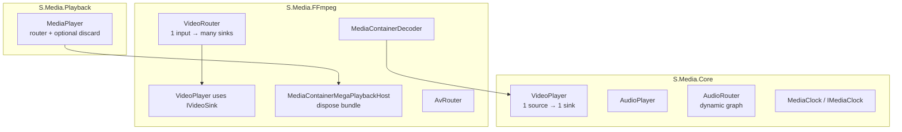

# Playback, `MediaPlayer`, and a future UI-hosted media application

**Update (2026):** **`S.Media.PlaybackHost` has been removed.** The smoke-specific graph lives under **`Tools/VideoPlaybackSmoke`** (`VideoPlaybackSmokeSession`, CLI options, HUD). **`S.Media.Playback.MediaPlayer`** now depends only on **`S.Media.Core`** + **`S.Media.FFmpeg`**: it always builds a **`VideoRouter`**, optional **`DiscardingVideoSink`** primary when no negotiation lead is supplied, and an **`AudioPlayer`** that owns mux audio so playback can run with **zero user sinks**. SDL, NDI, and PortAudio are **optional** references in the host app or in **`VideoPlaybackSmoke`**.

This document answers three questions in one place:

1. **How much of a “real” desktop media player (under `UI/` in the solution) is already supported** by the existing `S.Media.*` layering?
2. **What would need to change** so end users can treat playback as **generic sources + multiple sinks**, including **UI toolkit–hosted video** (e.g. Avalonia `OpenGLControlBase`)?
3. **Can outputs be attached while playback is running?** What is true today for **audio** vs **video**, and what is missing on the bundled **`MediaPlayer`** path?

It also records naming cleanup still possible (**“Mega”** on **`MediaContainerMegaPlaybackHost`**, smoke type names in the tool).

For clocking, negotiation, and GL concepts, see [MediaFramework-concepts.md](./MediaFramework-concepts.md).

---

## 0. Current `MediaPlayer` (library)

- **References:** `S.Media.Core`, `S.Media.FFmpeg` only (no SDL / NDI / PortAudio on the playback assembly).
- **Always:** `MediaContainerDecoder`, `VideoRouter`, `VideoPlayer` (into the router’s logical input), `MediaContainerMegaPlaybackHost` for dispose order, `AvRouter`.
- **Video negotiation lead:** pass an `IVideoSink` (e.g. SDL in the tool) or **`null`** to use an internal **`DiscardingVideoSink`** so decode runs with no visible sink until you **`AddOutput`** + **`TryAddRoute`**.
- **Audio:** default **`IncludeAudioRouter: true`** registers **`decoder.Audio`** on an **`AudioPlayer`**; you can run with **no audio sinks** (router still consumes the mux audio stream each chunk). Wire PortAudio from **`S.Media.PortAudio`** (`MediaContainerPlaybackHost.TryWirePortAudioMainForPlayer` or manual **`AddOutput`**).

---

## 1. Solution state: `UI/` today

The solution defines a **`UI`** solution folder (`MFPlayer.sln`), but there is **no application project** under `/UI` yet (no `.csproj`, no Avalonia/WPF/WinUI shell). A future media player app would be a **new project** there (or under `MediaFramework/Tools/` for prototypes) referencing the media stack assemblies it needs.

---

## 2. Layered architecture (mental model)

- **`VideoPlayer`** (`S.Media.Core`): one **`IVideoSource`**, one **`IVideoSink`**, one **`IMediaClock`**. Negotiation runs at construction. This is the **presentation pump** for a single video chain.
- **`VideoRouter`** (`S.Media.FFmpeg.Video`): multiplexes **one logical video input** to **many `IVideoSink` outputs** (fan-out, per-branch pixel handling). The sink registered as the input’s **primary** output drives negotiation.
- **`AudioPlayer`** + **`AudioRouter`**: many sources, many sinks, explicit routes; graph is **mutable while running** (see below).
- **`MediaContainerMegaPlaybackHost`**: owns **dispose order** for decoder + video + optional audio + optional router + optional freerun clock — not a router itself.
- **`MediaPlayer`** (`S.Media.Playback`): opens **`MediaContainerDecoder`**, always wires **`VideoRouter`** + **`VideoPlayer`**, optional internal **`DiscardingVideoSink`** when no primary sink is passed, optional **`AudioPlayer`** on mux audio, and **`MediaContainerMegaPlaybackHost`** for teardown. **SDL / NDI / PortAudio** are added by the app (see **`VideoPlaybackSmokeSession`** in the smoke tool).

---

## 3. What already works for a custom UI application

You **do not** need `MediaPlayer` to build a UI-hosted player. The supported pattern is:

1. Open **`MediaContainerDecoder`** on your media path (or your own demux/decode graph).
2. Create your **primary `IVideoSink`** (today many tests use **`SDL3GLVideoSink`**; a future UI would use an **`IVideoSink`** backed by your toolkit’s GL surface — see §8).
3. **Either**:
   - **Simplest video:** `new VideoPlayer(media.Video, yourSink, playClock)` — one display path, no fan-out; or
   - **Fan-out (local + NDI + recorder, etc.):** create **`VideoRouter`**, `AddOutput` for each sink, `AddInput` on the primary output id, `TryAddRoute` to additional outputs, then `new VideoPlayer(media.Video, routerInputRegistration.Sink, playClock)`.
4. Wire **audio** with **`MediaContainerPlaybackHost.TryCreatePortAudioMain`**, **`TryWirePortAudioMainForPlayer`** (when you already use **`MediaPlayer`**’s **`AudioPlayer`**), or your own **`AudioPlayer`** graph; use **`AvRouter`** / **`AvPlaybackCoordinator`** for coordinated play/pause/seek when you combine video + audio.

**Capabilities you get “for free” from the lower layers:**

| Concern | Status |
|--------|--------|
| Hardware decode, mux sharing, seek | **`MediaContainerDecoder`** + **`VideoPlayer`** / **`AudioPlayer`** |
| Multi **audio** outputs / routes while running | **`AudioRouter`** — explicitly **fully dynamic**; **`AudioPlayer.AddOutput`** / **`RemoveOutput`** |
| Multi **video** outputs (fan-out) | **`VideoRouter.AddOutput`**, **`TryAddRoute`**, **`TryRemoveRoute`**, **`RemoveOutput`** — designed for multiple **`IVideoSink`** branches |
| Clock mastering (audio drives video) | **`MediaClock`**, **`AudioPlayer`** primary sink (`IClockedSink` / `IPlaybackClock`) |
| Slow sinks (NDI, encoders) without blocking decode | **`VideoSinkPump`** + **`VideoSinkPumpAttachOptions`** on **`VideoRouter.AddOutput`**; audio per-sink pumps on **`AudioRouter`** |

**Threading contract (critical for UI):** **`VideoPlayer`** submits frames on the **clock driver thread** (same thread as **`IMediaClock.VideoTick`**). Handlers must return quickly; **`IVideoSink.Submit`** should hand work to a **render thread** or GPU queue. A UI control that only mutates GL/Vulkan on the UI thread must **marshal** accordingly (same as game engines).

---

## 4. What `MediaPlayer` / bundled session do today — and limits

### 4.1 Role

**`S.Media.Playback.MediaPlayer`** is a thin façade over **`MegaPlaybackSmokeSession`**. It is optimized for **“open this file with SDL + optional PA + optional NDI”**, not for a fully generic multi-input / toolkit-injected host.

### 4.2 Video router only when NDI is enabled

The bundled graph builds a **`VideoRouter`** **only when NDI is turned on**. Otherwise **`VideoPlayer`** talks **directly** to **`SDL3GLVideoSink`** — there is **no `VideoRouter` instance** to attach extra video sinks to.

Implication for **“add video output at runtime”** on the **`MediaPlayer`** path:

- **Today:** with default options (NDI off), **`MediaPlayer.VideoRouter`** is **`null`**. You cannot call **`AddOutput`** on a router that does not exist. Enabling NDI creates a router with at least **`sdl`** and **`ndi`** outputs; additional sinks could be registered on that router **if** you keep the same input id and call **`TryAddRoute`** (subject to negotiation rules in **`VideoRouter`** remarks).
- **Product gap:** for a generic player API, the bundled ctor should **always** construct a **`VideoRouter`** (even for a single window), so **runtime fan-out** and **uniform APIs** match the **`AudioPlayer`** story.

### 4.3 Primary video sink is not injectable

**`MegaPlaybackSmokeSession.TryCreate`** always constructs **`SDL3GLVideoSink`**. There is **no overload** to supply a user **`IVideoSink`** as the window (tracked in product open items as toolkit preview / **PO-18** in `Doc/Todo.md`).

### 4.4 “Mega” / “Smoke” naming

Types such as **`MegaPlaybackSmokeSession`**, **`MegaPlaybackSmokeHost`**, **`MediaContainerMegaPlaybackHost`**, and **`MegaPlaybackSmokeToolOptions`** read as **internal smoke-tool** names but are **public** surface for bundled playback. Renaming (and merging **`S.Media.PlaybackHost`** into **`S.Media.Playback`**) improves discoverability for library consumers and aligns with a **UI product** narrative.

**Suggested rename map (illustrative — implement in a dedicated PR):**

| Current | Suggested direction |
|--------|----------------------|
| `S.Media.PlaybackHost` (assembly) | Merge into `S.Media.Playback`; delete separate project |
| `MegaPlaybackSmokeSession` | `BundledFilePlaybackSession` or `FilePlaybackSession` |
| `MegaPlaybackSmokeHost` | `FilePlaybackHost` / `PlaybackSessionFactory` |
| `MegaPlaybackSmokeToolOptions` | `FilePlaybackToolOptions` (CLI-shaped) |
| `MegaPlaybackSmokePlaybackOptions` | `FilePlaybackOptions` |
| `MegaPlaybackSmokePresentationOptions` | `SdlWindowPresentationOptions` or `WindowPresentationOptions` |
| `MegaPlaybackSmokeVideoRouting` | `BundledVideoRouting.FormatLine` or move to tools-only |
| `MediaContainerMegaPlaybackHost` | `MediaContainerPlaybackBundle` or `MediaContainerAvDisposeHost` (in `S.Media.FFmpeg` — separate rename pass) |

---

## 5. Runtime outputs: audio vs video vs `MediaPlayer`

### 5.1 Audio — **already first-class while running**

**`AudioRouter`** documentation states the graph is **fully dynamic**: sources, sinks, and routes can be added or removed **while the router is running**, taking effect on the next chunk.

**`AudioPlayer.AddOutput`** registers a sink with the inner router; **`RemoveOutput`** tears one down and can repromote a primary clock sink when **`AutoWirePrimary`** is true.

So for a UI app using **`AudioPlayer`**, **adding a Bluetooth / secondary device / NDI audio mirror at runtime** is aligned with the current design.

### 5.2 Video — **router supports it; bundled path often does not expose a router**

**`VideoRouter.AddOutput`** registers additional **`IVideoSink`** instances. **`TryAddRoute(inputId, outputId)`** attaches an existing input to a new output; **`ReconfigureInputIfNeededLocked`** reconciles pixel paths when the branch set changes.

Caveats (see **`VideoRouter`** XML remarks):

- Each **output** is owned by **at most one** input at a time.
- **Removing** an output that is the **primary** for an input removes that **entire input** (by design).
- Adding branches may trigger **CPU conversion** on some paths (Windows shared NV12 + CPU branch remains a known limitation).

So **runtime video outputs are already a core FFmpeg-layer feature** — the main **product** gap is **always exposing a `VideoRouter`** (or an equivalent façade) from **`MediaPlayer`**, and documenting **safe ordering** (add output → route → optionally use **`VideoSinkPump`** for slow sinks).

### 5.3 `MediaPlayer` specifically

| Scenario | Runtime extra video sink? |
|----------|---------------------------|
| NDI off | **`VideoRouter` is null** — not without changing construction or bypassing **`MediaPlayer`** |
| NDI on | **`VideoRouter` non-null** — can **`AddOutput`** + **`TryAddRoute`** to the known **`ndiVideoRouterInputId`** (advanced; not wrapped in a friendly API yet) |

---

## 6. Multi-source / playlist / “library” style apps

**`MediaPlayer`** / **`MegaPlaybackSmokeSession`** assumes **one `MediaContainerDecoder`** per session. A playlist UI typically needs either:

- **Multiple sessions** (dispose and open next file), or  
- **A higher-level playlist host** that owns **`MediaContainerDecoder`**, swaps **`IVideoSource`** / seeks, or uses multiple decoders.

That orchestration is **application-level** today; the framework provides **primitives** (`MediaContainerDecoder`, `VideoPlayer`, routers) rather than a **playlist manager**.

---

## 7. `IAvPlaybackSession` and future `AvRouter`

**`IAvPlaybackSession`** (`S.Media.Core`) notes that a future full **`AvRouter`** graph could implement the same contract. Today, **`AvRouter`** (`S.Media.FFmpeg`) groups **decoder + video + clock + optional audio** for coordinated flush/seek defaults — it is **not** yet a single type that also owns **dynamic video router edits** for you. A UI app can still **own** **`VideoRouter`** + **`AudioPlayer`** and call **`AvPlaybackCoordinator`** for play/pause/seek.

---

## 8. UI directory integration (e.g. Avalonia)

**Goal:** an **`IVideoSink`** whose **`Submit`** hands **`VideoFrame`** data to a **control-hosted GL context** (e.g. Avalonia **`OpenGLControlBase`**), with correct thread marshalling.

**Building blocks already in tree:**

- **`IVideoSink`** / **`VideoFormat`** / negotiation via **`VideoFormatNegotiator`** (used by **`VideoPlayer`**).
- **`YuvVideoRenderer`** + **`GlVideoFormatSupport`** for shader/upload paths when you have an OpenGL context.
- **`SDL3GLVideoSink`** as a reference for D3D11 interop on Windows when decoding NV12 with shared handles.

**Work not done yet (see `Doc/Todo.md` PO-18):**

- A small **`S.Media.*`** (or app-local) package implementing **`IVideoSink`** for Avalonia’s GL lifecycle (`OpenGlInit`, `OnOpenGlRender`, fence sync with clock ticks).
- Sample wiring: **`VideoRouter`** primary = Avalonia sink; optional SDL/NDI as extra routes **or** SDL dropped in favor of UI-only video.
- **`MediaPlayer.TryCreate`** overload: **`IVideoSink primaryVideoSink`**, optional “no SDL” flag, and **always-on `VideoRouter`** for symmetry with audio.

---

## 9. Recommended phased roadmap

### Phase A — Documentation & API clarity (low risk)

- Keep behavior; publish this roadmap; cross-link from `Doc/Todo.md` if desired.
- Clarify in **`MediaPlayer`** XML that **`VideoRouter`** is absent unless NDI (until Phase B).

### Phase B — Generic bundled video graph (medium)

- Always construct **`VideoRouter`** in bundled **`TryCreate`**, with a single primary output for the window sink (SDL today), so **`AddOutput` + `TryAddRoute`** works for all default sessions.
- Optional **`VideoSinkPump`** defaults for slow sinks documented on **`MediaPlayer`**.

### Phase C — Merge `PlaybackHost` → `Playback` + rename (medium–high churn)

- Move source files from **`MediaFramework/Media/S.Media.PlaybackHost/`** into **`S.Media.Playback`**; update **`InternalsVisibleTo`**, **`MFPlayer.sln`**, **`VideoPlaybackSmoke`**, tests.
- Rename **`MegaPlaybackSmoke*`** / **`MediaContainerMegaPlaybackHost`** per §4.4 (FFmpeg type renames touch many cref/docs).

### Phase D — Injectable primary `IVideoSink` + UI sample (higher)

- **`TryCreate`** overload accepting **`IVideoSink`** (+ optional factory for window events if not SDL).
- Avalonia (or similar) sample under **`UI/`** using **`VideoPlayer`** + **`AudioPlayer`** + **`MediaContainerDecoder`**, with **`MediaPlayer`** optional once injection exists.

### Phase E — Longer-term product (optional)

- **`AvRouter`**-grade unified graph with dynamic video + audio under one façade (**`IAvPlaybackSession`** evolution).
- Coordinated multi-sink master clock policy (see **`AudioRouter`** remarks and Tier E/F clock backlog in `Doc/Todo.md`).

---

## 10. Summary table

| Goal | Today | Gap |
|------|-------|-----|
| UI app under `UI/` | No project yet | Add Avalonia/WPF/etc. host project |
| Multiple **audio** outputs at runtime | **Yes** (`AudioPlayer` / `AudioRouter`) | None for power users; **`MediaPlayer`** exposes **`AudioHost?.Player`** when PortAudio wired |
| Multiple **video** outputs at runtime | **Yes** at **`VideoRouter`** layer | **`MediaPlayer`** often has **no router**; need always-on router + API |
| Toolkit **primary** video (no SDL) | **No** in bundled session | Inject **`IVideoSink`** + disposal ownership contract |
| “Mega” / smoke naming | Public on bundled APIs | Rename + merge assemblies |
| Playlist / multi-file | Manual | App-level or future higher-level API |

---

## 11. References (code anchors)

Bundled construction: **`VideoRouter`** exists only when **`opt.NdiEnable`** — see `MegaPlaybackSmokeSession.TryCreate` in `MediaFramework/Media/S.Media.PlaybackHost/MegaPlaybackSmokeSession.cs` (NDI branch creates **`VideoRouter`**, registers SDL + NDI outputs, **`AddInput`**, **`TryAddRoute`**).

**`VideoRouter.AddOutput`** — `MediaFramework/Media/S.Media.FFmpeg/Video/VideoRouter.cs`.

**`AudioRouter`** dynamic graph remark — `MediaFramework/Media/S.Media.Core/Audio/AudioRouter.cs` (remarks: “fully dynamic”).

**`VideoPlayer`** single sink — `MediaFramework/Media/S.Media.Core/Video/VideoPlayer.cs` (constructor takes one **`IVideoSink`**).

---

*Last updated: 2026-05-13 — written to consolidate playback/UI direction, runtime sink story, and structural rename guidance.*
