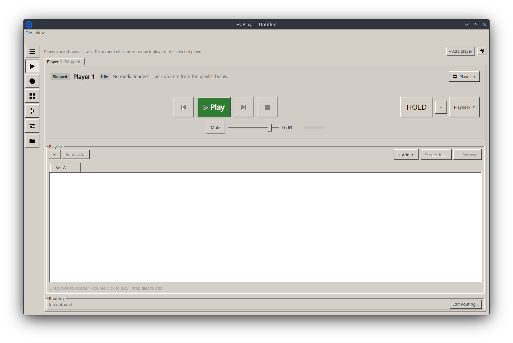

# HaPlay UX and accessibility review

Scope: all HaPlay views/dialogs, navigation, live playback workflows, visual hierarchy, keyboard/pointer access, localization, and accessibility. The application was launched and inspected at 1407×944; static AXAML/code-behind review covered 46 views.

> **Live walkthrough (2026-07-06).** Every workspace was launched and captured to corroborate the
> findings below (see [the verification pass](11-Verification-2026-07-06.md) for the mapping):
> [Cues](Assets/HaPlay-Cues.png) · [Soundboard](Assets/HaPlay-Soundboard.png) ·
> [Control](Assets/HaPlay-Control.png) · [I/O](Assets/HaPlay-IO.png) ·
> [Project](Assets/HaPlay-Project.png) · [Dark theme](Assets/HaPlay-DarkTheme-Players.png).
> The captures confirm UX-01/UX-02 (Players), the Panic-next-to-Stop proximity risk (Cues), the token
> shown in plaintext (Project), and UI-01 (dark theme still renders light). One small addition:
> **empty-state consistency** — I/O has a helpful empty state ("No outputs yet…") while Players,
> Soundboard, and Cues present blank areas; unify them behind one empty-state pattern (icon + one-line
> explanation + primary action).

## Overall assessment

The classic desktop visual language suits a technical show-control tool: controls are dense, grouping is visible, and there is little decorative animation. The workspace model (Players, Cues, Soundboard, Control, Outputs, Project) is understandable. The current presentation still reads as an internal test harness because hierarchy, status duplication, control sizing, branding, keyboard discovery, and accessibility are inconsistent.

The highest UX priority is not cosmetic modernization. It is making live-operation actions predictable, reachable by keyboard and assistive technology, and visually distinct from setup actions.

## Findings

### A11Y-01 — No automation names in 46 AXAML views (medium)

The audit found 227 `Button` elements, 7 `ToggleButton` elements, 119 tooltip declarations, and zero `AutomationProperties.*` declarations. Icon-only sidebar and transport controls therefore depend on glyph interpretation/tooltips. Tooltips do not provide a reliable accessible name and are not a substitute for keyboard discovery.

Recommendation: establish an accessibility baseline:

- set `AutomationProperties.Name` for every icon-only control and meaningful `HelpText` for non-obvious operations;
- expose state for play/pause, hold, selected workspace, endpoint health, and active cue;
- verify tab order, visible focus, screen-reader output, and 200% scaling;
- add automated accessibility-tree smoke assertions for the main workspaces.

### A11Y-02 — Soundboard tiles are pointer controls, not buttons (medium)

Each tile is a styled `Border` with a `Tapped` handler and context menu (`SoundboardView.axaml:213-243`). It is not naturally focusable, activatable with Enter/Space, or represented as a button to assistive technology. The copy-URL action is also pointer-context-menu dependent.

Recommendation: implement tiles as `Button`/`ListBoxItem` with a command, keyboard activation, selected/playing automation state, and a keyboard-accessible overflow/menu action. Preserve drag/drop/edit behavior through attached behaviors rather than removing control semantics.

### UX-01 — Player status is repeated and consumes the most prominent area (medium)

The live Players view showed “Player 1 / Stopped” in the tab and then separate “Stopped,” “Player 1,” and “Idle” chips below. At the same time the empty playlist had no strong central call to action. Repeating low-information state makes it harder to scan several players.

Recommendation: use one compact deck header with player name, transport state, current item, elapsed/remaining time, and route/output health. In an empty deck, make “Add media” the primary content-area action and explain drag-and-drop. Remove the permanent “players are shown as tabs” instruction after onboarding or show it only in the empty state.

### UX-02 — Transport/action sizing and placement are inconsistent (medium)

The central play control is very large, previous/next/stop are medium, playlist add/remove controls are tiny, and `Hold` plus playback mode sit far to the right as a separate island. The eye has to traverse the full window to understand one deck's live state. If Hold is safety-related, spatial separation without an explicit safety zone does not communicate that intent.

Recommendation: create a single transport strip with consistent hit targets (at least roughly 36–44 px for frequent live actions), clear grouping, and stable order. Put playback mode near next/previous behavior. Put Hold either adjacent to play with a strong latched state or in a labeled safety section. Keep destructive/remove actions visually secondary and separated from play.

### UX-03 — Keyboard shortcuts are powerful but mostly undiscoverable (medium)

Cue transport binds Space=GO, Escape=Panic, Enter=standby, Backspace=back, and Ctrl+P=preview in code-behind (`CuePlayerView.axaml.cs:49-84`). The media deck also binds Space, bracket navigation, comma/period jog, and plus/minus rate (`MediaPlayerView.axaml.cs:270-329`). Most are absent from visible menus/help and icon tooltips.

`Escape` triggering Panic is especially important: it is easy to press reflexively to dismiss a transient UI state. The handler excludes text/edit controls but intentionally remains active for other focused controls.

Recommendation: add a searchable keyboard-shortcut/help overlay and show accelerators in relevant menus/tooltips. Make live shortcuts configurable. Keep a global panic key only if the operator can clearly see the binding and latched result; consider requiring a modifier or providing a preference for bare Escape.

### UX-04 — Appearance choices currently over-promise (medium)

Dark/system theme and density are presented as settings but are not reliably implemented; see `UI-01` in the application report. A control that appears to work and silently does nothing is worse than an unavailable option.

Recommendation: hide unsupported appearance options until they alter the actual theme. When implemented, validate all workspaces/dialogs for contrast, disabled text, selection, warning/error colors, plots/meters, and native preview surfaces.

### UX-05 — Visual language is consistent but overly flat and low-contrast in secondary information (low/medium)

The Classic theme provides crisp boundaries, but many helper/status texts use reduced opacity on gray backgrounds. The wide Players screenshot has several visually similar bordered regions and little distinction between configuration, status, and primary action. Hard-coded view colors also undermine future theme consistency.

Recommendation: define semantic tokens for primary action, selected item, live/playing, held, warning, error/panic, success/healthy, disabled, and secondary text. Use spacing and section headers before adding more borders. Measure contrast rather than relying on opacity. Reserve saturated colors for operational state.

### UX-06 — The application ships the Avalonia logo (low, polish)

`App.axaml` references `Assets/avalonia-logo.ico`, and the live window displayed the Avalonia icon. This reinforces the prototype impression and makes the application harder to identify in task switchers/docks.

Recommendation: add a HaPlay icon family at platform-required sizes and a consistent wordmark/application name (`HaPlay`, not the stale `HaPlayer` references elsewhere).

### UX-07 — Localization is partial and inconsistent (low/medium)

`Strings.cs` is used in many places, but a scan found extensive raw English labels in AXAML, especially cue placement/crop/audio options, control workspace sections, and dialogs. This also makes terminology changes difficult even if translation is not planned.

Recommendation: route all user-facing strings through one resource system, including errors, tooltips, empty states, dialog titles, enum display names, and shortcut descriptions. Add a test/lint rule for raw `Text`, `Content`, `Header`, and `Title` literals with narrow exemptions.

### UX-08 — Minimum-size and scaling behavior needs a regression matrix (medium)

The main window allows 720×480 while several workspaces combine fixed inspectors, navigation, grids, and transport controls. The reviewed wide layout was usable, but static fixed widths and dense rows are likely to squeeze or hide priority actions near the minimum and under 150–200% scaling.

Recommendation: create screenshot/layout checks at 720×480, 1024×768, 1440×900, and 200% scale for every workspace and large dialog. At narrow widths, collapse setup inspectors before live controls, and allow secondary toolbars to wrap or move into overflow.

### UX-09 — Remote API secret presentation is unsafe (high when LAN is enabled)

The Project workspace shows the full long-lived token as selectable text and encourages copied query-token action URLs. This is both a security issue and a UX issue: it normalizes accidental secret exposure.

Recommendation: mask by default; provide explicit reveal, copy, and regenerate controls; explain where the credential is stored; and display a prominent warning/state when LAN is enabled without TLS.

## Workspace-specific recommendations

- **Players:** empty-state Add/Drop action; consolidated deck status; consistent transport strip; keep route health close to the current item.
- **Cues:** make GO/Back/Panic visually and spatially stable; distinguish selected, standby, active, held, and completed rows without color alone; expose shortcut hints.
- **Soundboard:** semantic buttons, strong playing/fading state, keyboard grid navigation, and an always-reachable Stop All.
- **Control:** separate device configuration from live monitor; pause/filter the monitor; make dropped/coalesced events visible after queue bounding.
- **Outputs:** separate patch editing from live health; show which players/cues currently own an output before allowing disruptive edits.
- **Project:** place save/project identity first, environment/cache/remote administration second; treat API token as a credential, not informational text.

## Suggested UX acceptance checks

1. Every live operation is possible with keyboard only and has a visible focus state.
2. A screen reader can identify every icon-only button, soundboard tile, state, and selected workspace.
3. GO, Panic/Stop All, Hold, and remove/delete cannot be confused by proximity or identical styling.
4. No critical state is communicated only by color.
5. The main workflows remain operable at 720×480 and 200% scale.
6. Appearance settings cause observable, tested changes or are not shown.

